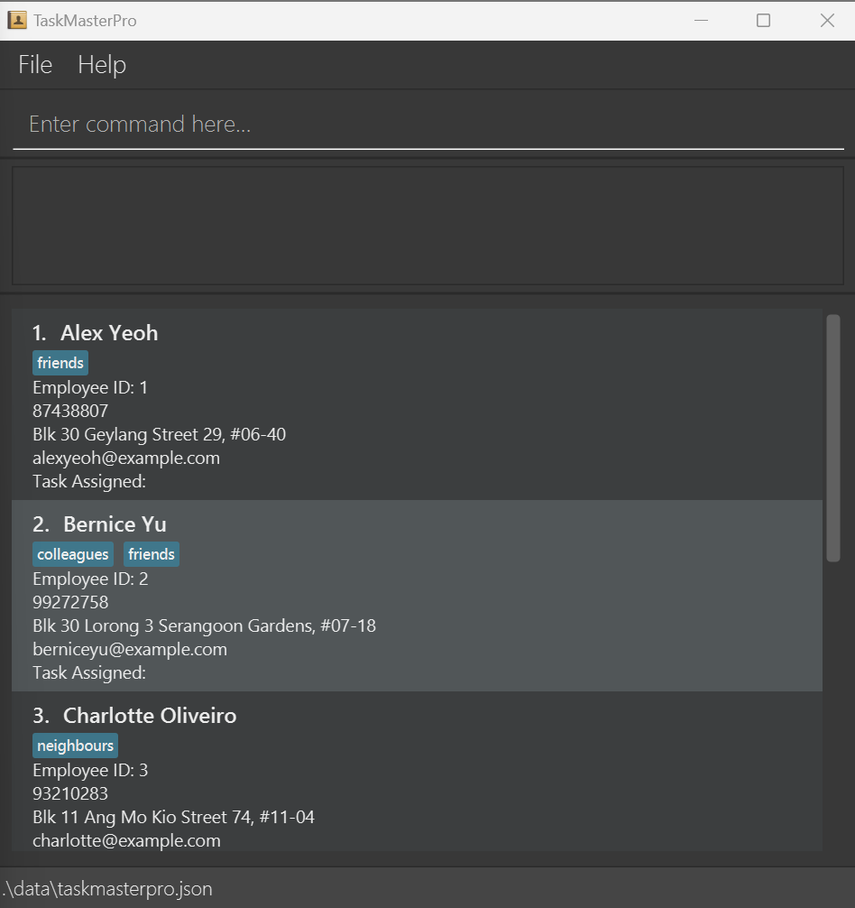

Welcome to the user guide for TaskMasterPro.  

TaskMasterPro is a desktop app designed for **managing employees and tasks**, optimized for use via a **Command Line Interface** (CLI) while still having the benefits of a Graphical User Interface (GUI).  

If you can type fast, TaskMasterPro can get your contact management tasks done faster than traditional GUI apps! No matter whether you are a manager or a team lead who has to manage a team and keep track of their deliverables, TaskMasterPro can help you!  

Refer to the `Quick Start` section to get the app running and the `Features` section on the commands that are available for use.  

If you run into any issues using the program try checking through the `FAQ` or `Known Issues` sections to see if the issues has already been brought up and there are any known solutions.  

# Table of Contents
1. [Quick Start](#quick-start)
2. [Features](#features)
   3. [help](#viewing-help--help)
   4. [list](#listing-all-employees-list)
   5. [add](#adding-an-employee-add)
   6. [edit](#editing-an-employee-edit)
   7. [delete](#deleting-an-employee-delete)
   8. [find](#locating-employees-by-employee-names--find)
   9. [task](#adding-a-task-task)
   10. [listtasks](#listing-all-tasks--listtasks)
   11. [deletetask](#deleting-a-task--deletetask-task_id)
   12. [findtasks](#locating-tasks-by-task-names--findtasks)
   13. [assigntask](#assign-a-task-to-employee--assigntask)
   14. [unassigntask](#unassign-a-task-to-employee--unassigntask)
   15. [mark](#mark-a-task--mark)
   16. [unmark](#unmark-a-task--unmark)
   17. [clear](#clearing-all-entries--clear)
   18. [exit](#exiting-the-program--exit)
   19. [Saving the data](#saving-the-data)
   20. [Editing the data file](#editing-the-data-file)
21. [FAQ](#faq)
22. [Known Issues](#known-issues)
23. [Command Summary](#command-summary)

--------------------------------------------------------------------------------------------------------------------

## Quick Start

1. Ensure you have Java `11` installed in your Computer.

1. Download the latest `taskmasterpro.jar` from [here](https://github.com/AY2324S2-CS2103T-T15-4/tp/releases/tag/v1.4).

1. Copy the file to the folder you want to use as the _home folder_ for your TaskMasterPro.

1. Open a command terminal, `cd` into the folder you put the jar file in, and run the command `java -jar taskmasterpro.jar` to start the application. A GUI similar to the image below should appear in a few seconds.  

1. Type your commands in the command box and press Enter to execute it. e.g. typing **`help`** and pressing Enter will open the help window. 
   Some example commands you can try:

    * `list` : Lists all employees.

    * `add n/John Doe p/98765432 e/johnd@example.com a/John street, block 123, #01-01` : Adds an employee named `John Doe` to TaskMasterPro.

    * `delete 3` : Deletes the employee with employee ID = 3.

    * `task meeting` : Creates a task with description called meeting.

    * `clear` : Deletes all stored data.

    * `exit` : Exits the app.
 
1. Refer to the [Features](#features) below for details of each command.

--------------------------------------------------------------------------------------------------------------------

## Features

**:information_source: Notes about the command format:** 

* Words in `UPPER_CASE` are the parameters to be supplied by the user. 
  e.g. in `add n/NAME`, `NAME` is a parameter which can be used as `add n/John Doe`.

* Items in square brackets are optional. 
  e.g `n/NAME [t/TAG]` can be used as `n/John Doe t/friend` or as `n/John Doe`.

* Items with `…`​ after them can be used multiple times including zero times. 
  e.g. `[t/TAG]…​` can be used as ` ` (i.e. 0 times), `t/friend`, `t/friend t/family` etc.

* Parameters can be in any order. 
  e.g. if the command specifies `n/NAME p/PHONE_NUMBER`, `p/PHONE_NUMBER n/NAME` is also acceptable.

* Extraneous parameters for commands that do not take in parameters (such as `help`, `list`, `exit` and `clear`) will be ignored. 
  e.g. if the command specifies `help 123`, it will be interpreted as `help`.

* If you are using a PDF version of this document, be careful when copying and pasting commands that span multiple lines as space characters surrounding line-breaks may be omitted when copied over to the application.

* Any command that requires `EMPLOYEE_ID` or `TASK_ID` as a parameter does not refer to the nominal number in the list but rather specifically the id as indicated below:

### Viewing help : `help`

Shows a message explaining how to access the help page.

Format: `help`
### Listing all employees: `list`

Shows a list of all employees in TaskMasterPro.

Format: `list`

### Adding an employee: `add`

Adds an employee to TaskMasterPro.

Format: `add n/NAME p/PHONE_NUMBER e/EMAIL a/ADDRESS [t/TAG]…​`

:bulb: **Tip:**
Make sure that your parameter's formats are valid! 

NAME : Only alphanumeric characters and spaces 

PHONE_NUMBER : An 8 digit number beginning with either 6, 8 or 9 

EMAIL : Should be of the format local-part@domain and adhere to the following constraints, 

1. The local-part should only contain alphanumeric characters and these special characters, excluding the parentheses, (+_.-). The local-part may not start or end with any special characters. 
2. This is followed by a '@' and then a domain name. The domain name is made up of domain labels separated by periods. 

   The domain name must: 
   * end with a domain label at least 2 characters long 
   * have each domain label start and end with alphanumeric characters

 

:exclamation: **Caution:**

As of now you cannot create multiple employees with the same name.

There are also certain problems that could occur if you are not careful with some parameters!

NAME : This is case-sensitive and whitespace sensitive, you could accidentally add multiple of the same employee with different capitalizations.

Examples:
* `add n/AikenDueet p/82311231 e/aiken@example.com a/Dueet street, block 123, #01-01`
* `add n/Ben Diddle t/friend e/bendiddle@example.com a/Newgate Prison p/81092109 t/criminal`

### Editing an employee: `edit`

Edits an employee's details in TaskMasterPro.

Format: `edit EMPLOYEE_ID [n/NAME] [p/PHONE_NUMBER] [e/EMAIL] [a/ADDRESS] [t/TAG]…​`

:bulb: **Tip:**
You can specify `t/` multiple times to add more tags

 

:exclamation: **Caution:**
When you run this function with `t/` all the existing tags will be removed if not specified again.

Examples:
* `edit 1 n/AikenDueet p/82311231 e/aiken@example.com`
* `edit 2 a/Newgate Prison p/81092109 t/criminal`

### Deleting an employee: `delete`

Deletes the specified employee from TaskMasterPro.

Format: `delete EMPLOYEE_ID`

* Deletes the employee with the specified `EMPLOYEE_ID`.
* The employee id refers to the number shown in the displayed employee list.
* The id **should be a positive integer** 1, 2, 3, …​

Examples:
* `list` followed by `delete 3` deletes the employee with id 3 in TaskMasterPro.

### Locating employees by employee names : `find`

Finds employees whose names contain any of the given keyword.

Format: `find KEYWORD [MORE_KEYWORDS]`

* The search is case-insensitive. e.g. `alex` will match `Alex`.
* The order of the keywords does not matter. e.g. `Yeoh Alex` will match `Alex Yeoh`.
* Only full words will be matched. e.g. `Ale` will not match `Alex`.
* Employees matching at least 1 keyword will be returned. e.g. `Alex Yu` will return employees with
`Alex` or `Yu` in their names.

Examples:
* `find alex` returns employees with `alex` in their names.

### Adding a task: `task`

Adds a task to TaskMasterPro.

Format: `task TASK_DESCRIPTION`

:bulb: **Tip:**
The description for the task is required and can be any length with spaces in between

:exclamation: **Caution:**
Avoid naming 2 tasks with the same name as TaskMasterPro will not differentiate them! It could make things complicated!

Examples:
* `task Weekly meeting`
* `task Submitting report`

### Listing all tasks : `listtasks`

Shows a list of all tasks in TaskMasterPro.

Format: `listtasks`

### Deleting a task : `deletetask TASK_ID`

Deletes the specified task from TaskMasterPro.

Format: `deletetask TASK_ID`

* Deletes the task with the specified `TASK_ID`.
* The task id refers to the number shown in the displayed task list.
* The id **should be a positive integer** 1, 2, 3, …​

Examples:
* `listtasks` followed by `deletetask 2` deletes the task with id 2 in TaskMasterPro.

### Locating tasks by task names : `findtasks`

Finds tasks whose names contain any of the given keyword.

Format: `findtasks KEYWORD [MORE_KEYWORDS]`

* The search is case-insensitive. e.g. `report` will match `Report`.
* The order of the keywords does not matter. e.g. `report meeting` will match `meeting report`.
* Only full words will be matched. e.g. `report` will not match `reports`.
* Tasks matching at least 1 keyword will be returned. e.g. `report meeting` will return tasks with
`report` or `meeting` in their names.

Examples:
* `findtasks report` returns tasks with `report` in their names.

### Assign a task to employee : `assigntask`

Assigns a task object to employee.

Format: `assigntask TASK_ID EMPLOYEE_ID`

* Assigns a task object with id `TASK_ID` to an employee with id `EMPLOYEE_ID`.

Examples:
* `assigntask` followed by `1 5` assigns task object with id 1 to an employee with id 5, Irfan.

### Unassign a task to employee : `unassigntask`

Unassigns a task object from an employee.

Format: `unassigntask TASK_ID EMPLOYEE_ID`

* Unassigns a task object with id `TASK_ID` from an employee with id `EMPLOYEE_ID`.

Examples:
* `unassigntask` followed by `1 5` unassigns task object with id 1 from an employee with id 5.

### Mark a task : `mark`

Marks a task as done.

Format: `mark TASK_ID`

* Marks a specified task with id `TASK_ID`. The task will be labeled as "Completed".

Examples:
* `mark` followed by a valid integer `TASK_ID` which corresponds to a real task in the database.
* `mark 1`

### Unmark a task : `unmark`

Unmarks a task.

Format: `unmark TASK_ID`

* Unmarks a specified task with id `TASK_ID`. The task will be labeled as "In Progress".

Examples:
* `unmark` followed by a valid integer `TASK_ID` which corresponds to a real task in the database.
* `unmark 1`

### Clearing all entries : `clear`

Clears all entries from TaskMasterPro.

Format: `clear`

### Exiting the program : `exit`

Exits the program.

Format: `exit`

### Saving the data

TaskMasterPro data are saved in the hard disk automatically after any command that changes the data.

There is no need to save manually.

Note that saves are only made after running a command, not on app startup!

### Editing the data file

TaskMasterPro data are saved automatically as a JSON file [JAR file location]/data/taskmasterpro.json . Advanced users are welcome to update data directly by editing that data file.

:exclamation: **Caution:**
If your changes to the data file makes its format invalid, TaskMasterPro will discard all data and start with the original sample data file at the next run. Hence, it is recommended to take a backup of the file before editing it. 
Furthermore, certain edits can cause TaskMasterPro to behave in unexpected ways (e.g., if a value entered is outside of the acceptable range). Therefore, edit the data file only if you are confident that you can update it correctly.

--------------------------------------------------------------------------------------------------------------------

## FAQ

**Q**: How do I transfer my data to another Computer? 
**A**: Install the app in the other computer and overwrite the data file it creates with the file that contains the data of your previous TaskMasterPro home folder.

--------------------------------------------------------------------------------------------------------------------

## Known Issues

1. **When using multiple screens**, if you move the application to a secondary screen, and later switch to using only the primary screen, the GUI will open off-screen. The remedy is to delete the `preferences.json` file created by the application before running the application again.
2. **For advanced users who choose to manually change the JSON file**, you could change the employee and task id to negative. This could potentially reset the system but there is also a chance that the system will load with the indicated negative ids, the application will function as normal with the negative id. This will be addressed in a future iteration.

--------------------------------------------------------------------------------------------------------------------

## Command Summary

Action | Format, Examples
--------|------------------
**Help** | `help`
**Add employee** | `add n/NAME p/PHONE_NUMBER e/EMAIL a/ADDRESS [t/TAG]…​`   e.g., `add n/Ben Diddle t/friend e/bendiddle@example.com a/Newgate Prison p/81092109 t/criminal`
**Edit employee** | `edit EMPLOYEE_ID [n/NAME] [p/PHONE_NUMBER] [e/EMAIL] [a/ADDRESS] [t/TAG]…​`   e.g., `edit 2 a/Newgate Prison p/81092109 t/criminal`
**List employees** | `list`
**Find employees** | `find KEYWORD [MORE_KEYWORDS]`  e.g., `find alex`
**Delete employee** | `delete EMPLOYEE_ID`   e.g., `delete 2`
**Add task** | `task TASK_DESCRIPTION`   e.g., `task Weekly meeting`
**List tasks** | `listtasks`
**Delete task** | `deletetask TASK_ID`  e.g., `deletetask 3`
**Find tasks** | `findtasks KEYWORD [MORE_KEYWORDS]`  e.g., `findtasks report`
**Mark task** | `mark TASK_ID`  e.g., `mark 1`
**Unmark task** | `unmark TASK_ID`  e.g., `unmark 1`
**Assign task to an employee** | `assigntask TASK_ID EMPLOYEE_ID`   e.g., `assigntask 1 2`
**Unassign employee from a task** | `unassigntask TASK_ID EMPLOYEE_ID`   e.g., `unassigntask 1 1`
**Clear** | `clear`
**Exit** | `exit`
